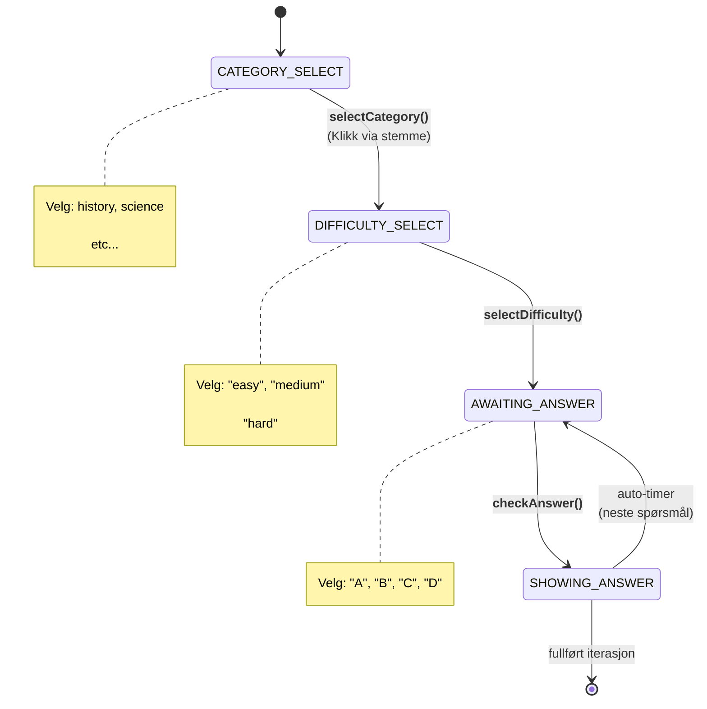

```mermaid
stateDiagram-v2
    [*] --> CATEGORY_SELECT
    CATEGORY_SELECT --> DIFFICULTY_SELECT: <b>selectCategory()</b><br>(Klikk via stemme)
    DIFFICULTY_SELECT --> AWAITING_ANSWER: <b>selectDifficulty()</b>
    AWAITING_ANSWER --> SHOWING_ANSWER: <b>checkAnswer()</b>
    SHOWING_ANSWER --> AWAITING_ANSWER: auto‑timer<br>(neste spørsmål)
    SHOWING_ANSWER --> [*]: fullført iterasjon
    note right of CATEGORY_SELECT
      Velg: history, science <br>
      etc...
      
    end note
    note right of DIFFICULTY_SELECT
      Velg: "easy", "medium" <br>
      "hard"
    end note
    note right of AWAITING_ANSWER
      Velg: "A", "B", "C", "D"
    end note
```