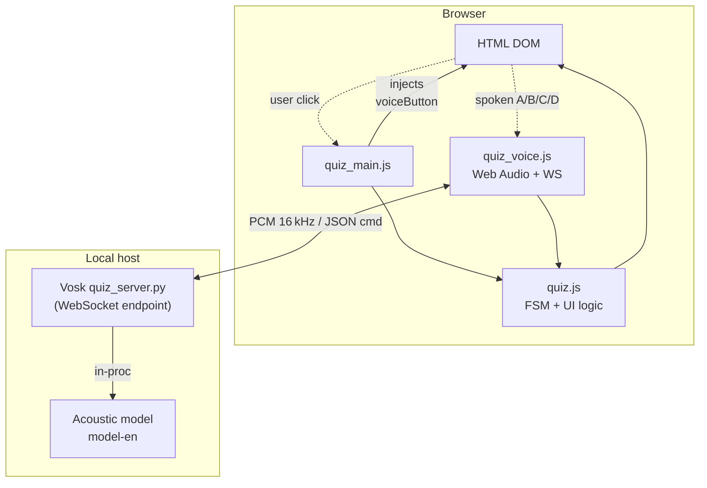

```mermaid
flowchart TD
    %% --------- clusters ----------
    subgraph "Browser"
        direction TB
        DOM["HTML DOM"]
        A["quiz_main.js"]
        B["quiz.js<br>FSM + UI logic"]
        C["quiz_voice.js<br>Web Audio + WS"]
    end

    subgraph "Local host"
        direction TB
        Py["Vosk quiz_server.py<br>(WebSocket endpoint)"]
        Model["Acoustic model<br>model‑en"]
    end

    %% --------- intra‑browser wiring ----------
    A -- injects<br>voiceButton --> DOM
    A --> B
    C --> B
    B --> DOM      
    DOM -. user click .-> A   
    DOM -.spoken A/B/C/D.-> C 

    %% --------- network & model ----------
    C <-->|PCM 16 kHz / JSON cmd| Py
    Py -- in‑proc --> Model
```