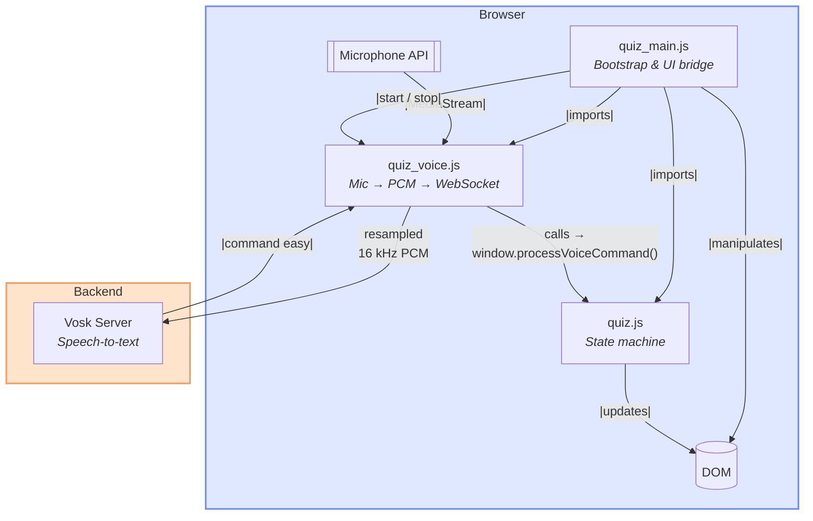

```mermaid
graph TD
    %% ---------- Browser ----------
    subgraph Browser
        style Browser fill:#dfe8ff,stroke:#6b88ff,stroke-width:2px
        QMain[quiz_main.js<br/><i>Bootstrap &amp; UI bridge</i>]
        QLogic[quiz.js<br/><i>State&nbsp;machine</i>]
        QVoice[quiz_voice.js<br/><i>Mic → PCM → WebSocket</i>]
        DOM[(DOM)]
        Mic[[Microphone API]]
    end

    %% ---------- Backend ----------
    subgraph Backend
        style Backend fill:#ffe4cc,stroke:#ff9955,stroke-width:2px
        Vosk[Vosk Server<br/><i>Speech‑to‑text</i>]
    end

    %% relations inside browser
    QMain --|imports|--> QLogic
    QMain --|imports|--> QVoice
    QMain --|manipulates|--> DOM
    QLogic --|updates|--> DOM
    QVoice -- "calls →<br/>window.processVoiceCommand()" --> QLogic

    %% audio flow
    Mic --|MediaStream|--> QVoice
    QVoice -- "resampled<br/>16 kHz PCM" --> Vosk
    Vosk --|command easy|--> QVoice        

    %% clean‑up control
    QMain --|start / stop|--> QVoice
```