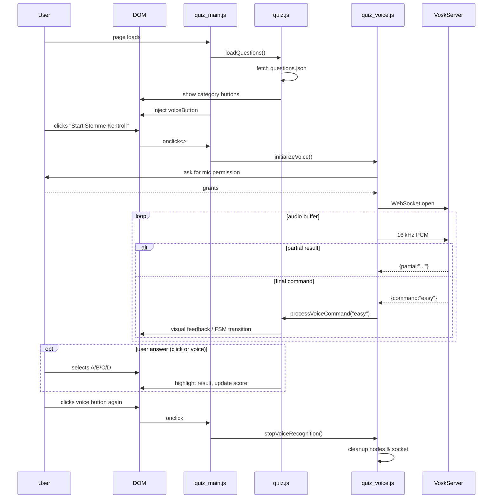

```mermaid
sequenceDiagram
    participant User
    participant DOM
    participant quiz_main.js
    participant quiz.js
    participant quiz_voice.js
    participant VoskServer

    User->>quiz_main.js: page loads
    quiz_main.js->>quiz.js: loadQuestions()
    quiz.js->>quiz.js: fetch questions.json
    quiz.js->>DOM: show category buttons
    quiz_main.js->>DOM: inject voiceButton   

    User->>DOM: clicks "Start Stemme Kontroll"
    DOM->>quiz_main.js: onclick<>
    quiz_main.js->>quiz_voice.js: initializeVoice()

    quiz_voice.js->>User: ask for mic permission
    User-->>quiz_voice.js: grants
    quiz_voice.js->>VoskServer: WebSocket open

    loop audio buffer
        quiz_voice.js->>VoskServer: 16 kHz PCM
        alt partial result
            VoskServer-->>quiz_voice.js: {partial:"..."}
        else final command
            VoskServer-->>quiz_voice.js: {command:"easy"}
            quiz_voice.js->>quiz.js: processVoiceCommand("easy")
            quiz.js->>DOM: visual feedback / FSM transition
        end
    end

    opt user answer (click or voice)
        User->>DOM: selects A/B/C/D
        quiz.js->>DOM: highlight result, update score
    end

    User->>DOM: clicks voice button again
    DOM->>quiz_main.js: onclick
    quiz_main.js->>quiz_voice.js: stopVoiceRecognition()
    quiz_voice.js->>quiz_voice.js: cleanup nodes & socket   
```