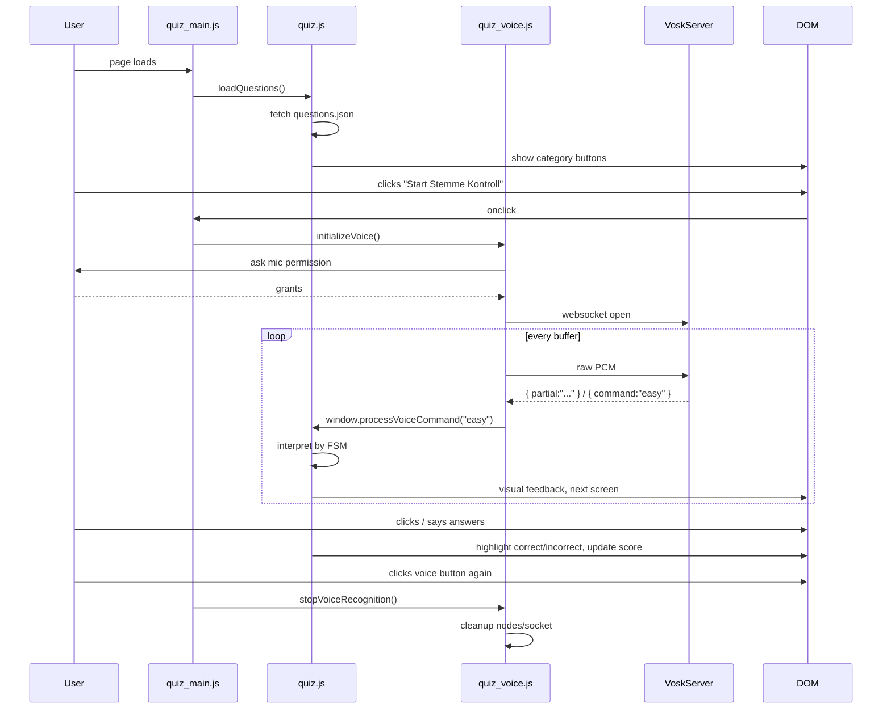

```mermaid
sequenceDiagram
    participant User
    participant quiz_main.js
    participant quiz.js
    participant quiz_voice.js
    participant VoskServer

    User->>quiz_main.js: page loads
    quiz_main.js->>quiz.js: loadQuestions()
    quiz.js->>quiz.js: fetch questions.json
    quiz.js->>DOM: show category buttons

    User->>DOM: clicks "Start Stemme Kontroll"
    DOM->>quiz_main.js: onclick
    quiz_main.js->>quiz_voice.js: initializeVoice()

    quiz_voice.js->>User: ask mic permission
    User-->>quiz_voice.js: grants
    quiz_voice.js->>VoskServer: websocket open
    loop every buffer
        quiz_voice.js->>VoskServer: raw PCM
        VoskServer-->>quiz_voice.js: { partial:"..." } / { command:"easy" }
        quiz_voice.js->>quiz.js: window.processVoiceCommand("easy")
        quiz.js->>quiz.js: interpret by FSM
        quiz.js->>DOM: visual feedback, next screen
    end

    User->>DOM: clicks / says answers
    quiz.js->>DOM: highlight correct/incorrect, update score

    User->>DOM: clicks voice button again
    quiz_main.js->>quiz_voice.js: stopVoiceRecognition()
    quiz_voice.js->>quiz_voice.js: cleanup nodes/socket
```